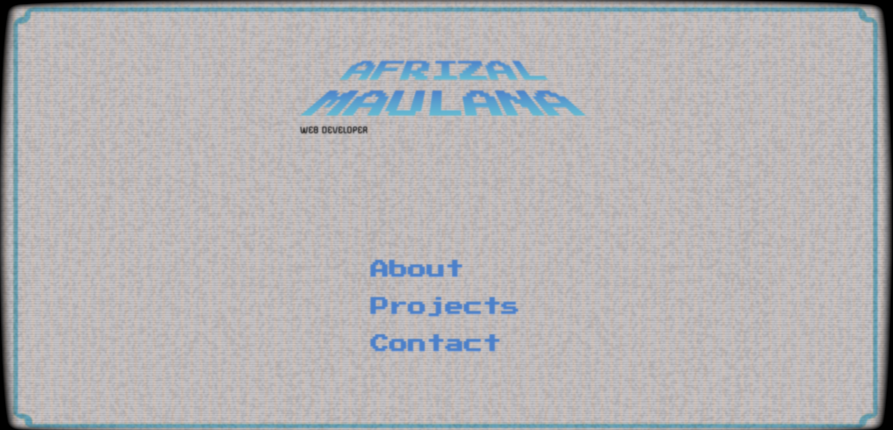
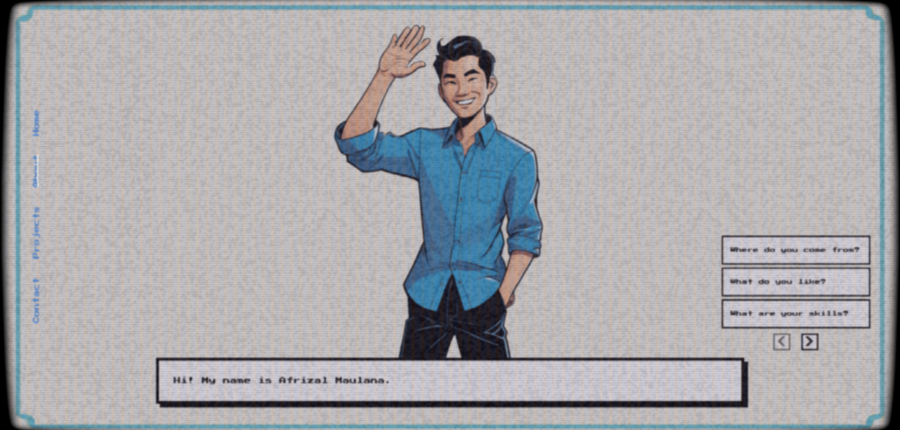
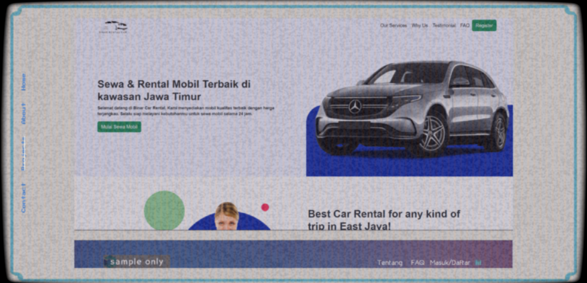
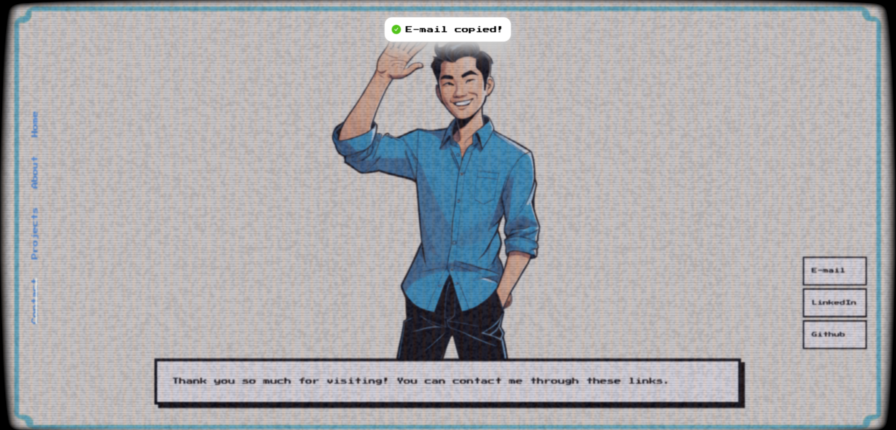

# Afrizal's Portfolio

## Description

This is my personal portfolio website showcasing my career journey, skills, and completed projects. Built using modern technologies, the website provides an interactive and responsive experience for visitors.

## About Me

I'm Afrizal Maulana Muhammad, a web developer specializing in front-end development. I have experience building web applications using React.js, Ant Design, Material-UI, and other modern technologies. I'm passionate about improving my skills and delivering innovative digital solutions.

## Screenshots

  <table>
    <tr>
      <td></td>
      <td></td>
    </tr>
    <tr>
      <td></td>
      <td></td>
    </tr>
  </table>

## Technologies Used

Check out the live version of my portfolio : [Afrizal Maulana](https://afrizal.vercel.app/)

## Features

- **About Me**: A brief overview of my background, vision, and work experience.
- **Projects**: A showcase of various projects I've worked on, with descriptions and technologies used.
- **Contact**: Easy-to-use contact form and additional ways to reach me.
- **Responsive Design**: Optimized for both desktop and mobile devices.

## Technologies Used

- **Frontend**: React.js
- **Additional Tools**: GitHub for version control, Vercel for hosting
